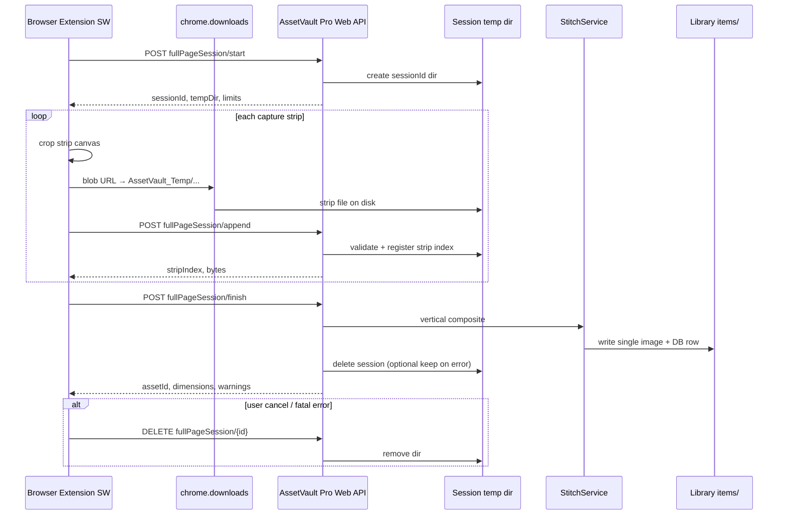

# 整页截图 · 会话式拼接 API（方案 B）完整规格

> **状态**：已实现（Pro Web API + 扩展 `importFullPageViaSession`；旧版 Pro 自动回退扩展内合并）  
> **读者**：AssetVault Pro 后端/主进程、浏览器扩展、集成脚本作者  
> **关联**：扩展 `stitchAndImportFullPage`（`src/background/service-worker.ts`）、布局纯函数（`src/shared/fullpage-capture.ts`）

---

## 1. 目标与范围

### 1.1 业务目标

| 目标 | 说明 |
|------|------|
| **一张资产** | 整页截图在资料库中对应 **1 个** `assetId`，预览为完整长图 |
| **高画质** | 合并与最终编码在 **桌面端** 完成，避免扩展内二次缩小 + 380KB JSON 压图 |
| **可扩展** | 单条带可大于 HTTP body 上限；总页长可接近 Pro 已有 **300MB / 大像素** 能力 |
| **可恢复** | 会话失败可 `abort` 并清理；应用崩溃后可扫过期会话目录 |

### 1.2 非目标（本版不做）

- WebSocket 实时进度（v1 用 HTTP 轮询 `session/get` 可选）
- 横向拼接、PDF 多页
- 在库内保留「条带中间资产」（条带仅会话临时文件，不入库）

### 1.3 职责划分

```text
浏览器扩展                          AssetVault Pro
─────────────────────────────────────────────────────────
滚动 + captureVisibleTab            —
按布局裁切条带 Canvas               —
条带 → 本地临时 JPEG/PNG 文件       校验路径、登记会话
—                                   纵向拼接（Sharp 等）
—                                   高质量编码 + importSingleAsset
—                                   写 sourceUrl / metadata、清理 temp
Toast / 部分成功提示                返回 assetId / warnings
```

---

## 2. 为何采用方案 B（会话式）

方案 A（单次 `stitchFullPage` 提交全部 `filePath`）在条带多、单文件 tens of MB 时仍可能触及 **单次 JSON 体积** 或 **请求超时**。

方案 B 将流程拆为 **start → append（可重复）→ finish**，具备：

1. **增量上传**：每段截图完成后立即 `append`，扩展内存可释放该段 Canvas。  
2. **独立超时**：`append` 短超时（30s），`finish` 长超时（120s+）。  
3. **可取消**：用户取消滚动时可 `abort`，不留下半成品资产。  
4. **与现有下载路径一致**：扩展已具备 `AssetVault_Temp/{uuid}-strip-N.jpg` 模式，无需 base64。  
5. **便于排错**：会话目录保留条带至 `finish` 成功或 `abort`。

---

## 3. 总体架构



---

## 4. API 概览

Base：`http://127.0.0.1:41596/api/v1`（与现有 v1 一致，JSend、Token 规则不变）

| 方法 | 路径 | 作用 |
|------|------|------|
| `POST` | `/asset/fullPageSession/start` | 创建会话，返回 `sessionId` 与限制 |
| `POST` | `/asset/fullPageSession/append` | 登记一条带文件（本地路径） |
| `POST` | `/asset/fullPageSession/finish` | 拼接并导入为 **一个** 资产 |
| `DELETE` | `/asset/fullPageSession/{sessionId}` | 取消并删除临时文件 |
| `GET` | `/asset/fullPageSession/{sessionId}` | （可选）查询进度/已 append 条数 |

OpenAPI 分组建议：`asset` → tag `fullPageSession`。

---

## 5. 接口契约（详细）

### 5.1 `POST /asset/fullPageSession/start`

创建会话。绑定**当前已打开的资料库**（与 `/asset/import` 相同前提）。

**Request**

```json
{
  "layout": {
    "widthPx": 2552,
    "contentHeightPx": 59947,
    "stripHeightsPx": [31347, 28600],
    "overlapPx": 120,
    "devicePixelRatio": 2
  },
  "output": {
    "filename": "screenshot-fullpage-1730123456789.jpg",
    "format": "jpeg",
    "quality": 92,
    "targetFolderId": null,
    "duplicatePolicy": "import_copy"
  },
  "sourceMeta": {
    "pageUrl": "https://www.example.com/board",
    "pageTitle": "Example Board"
  },
  "options": {
    "maxOutputPixels": 120000000,
    "maxOutputSide": 32768,
    "sessionTtlSeconds": 3600
  }
}
```

| 字段 | 类型 | 必填 | 说明 |
|------|------|------|------|
| `layout.widthPx` | number | 是 | 条带统一宽度（设备像素） |
| `layout.contentHeightPx` | number | 是 | 整页逻辑高度（与扩展 `exportHeightPx` 一致） |
| `layout.stripHeightsPx` | number[] | 是 | 计划条带高度；**可与实际 append 数量不一致**（扩展可能少截几段），finish 以 **实际 append** 为准 |
| `layout.overlapPx` | number | 否 | **扩展方案 B 必须传 0**：滚动重叠已在扩展条带 Canvas 内合成；Pro 再裁 overlap 会在导出条带接缝处删内容并出现黑/白缝 |
| `layout.devicePixelRatio` | number | 否 | 仅写入 metadata，默认 1 |
| `output.filename` | string | 是 | 入库文件名，须合法扩展名 |
| `output.format` | `"jpeg"` \| `"png"` | 否 | 默认 `jpeg` |
| `output.quality` | number | 否 | JPEG 1–100，默认 **92** |
| `output.targetFolderId` | string \| null | 否 | 目标文件夹 UUID |
| `output.duplicatePolicy` | string | 否 | 默认 `import_copy`；支持 `use_existing` |
| `sourceMeta.pageUrl` | string | 否 | 写入资产 `sourceUrl`（http/https） |
| `sourceMeta.pageTitle` | string | 否 | 可写入 `notes` 或 `metadata.pageTitle` |
| `options.maxOutputPixels` | number | 否 | 合成图像素上限，默认 **120_000_000** |
| `options.maxOutputSide` | number | 否 | 单边上限，默认 **32768** |
| `options.sessionTtlSeconds` | number | 否 | 空闲会话过期秒数，默认 **3600** |

**Response `data`**

```json
{
  "sessionId": "fp_8f3c2a1b-4e5d-6f7a-8b9c-0d1e2f3a4b5c",
  "tempDir": "C:\\Users\\me\\Downloads\\AssetVault_Temp\\fullpage\\fp_8f3c2a1b...",
  "limits": {
    "maxStrips": 32,
    "maxStripBytes": 52428800,
    "maxSessionBytes": 314572800,
    "appendTimeoutMs": 30000,
    "finishTimeoutMs": 180000
  },
  "expiresAt": "2026-06-03T12:00:00.000Z"
}
```

| 字段 | 说明 |
|------|------|
| `sessionId` | 全局唯一，建议前缀 `fp_` + UUID |
| `tempDir` | 本会话专用目录；**append 的 filePath 必须落在该目录下**（见 §7） |
| `limits` | 扩展用于前置校验；服务端在 append/finish 时强制 |

**错误码**

| code | 场景 |
|------|------|
| `LIBRARY_NOT_OPEN` | 未打开资料库 |
| `INVALID_REQUEST` | 字段非法、width/height ≤ 0 |
| `FULLPAGE_SESSION_LIMIT` | 全局并发会话数超限（建议 ≤ 4） |

---

### 5.2 `POST /asset/fullPageSession/append`

登记一条已写入磁盘的条带。**不**在请求体传 base64（v1）。

**Request**

```json
{
  "sessionId": "fp_8f3c2a1b-4e5d-6f7a-8b9c-0d1e2f3a4b5c",
  "stripIndex": 0,
  "filePath": "C:\\Users\\me\\Downloads\\AssetVault_Temp\\fullpage\\fp_8f3c...\\strip-0000.jpg",
  "stripHeightPx": 31347,
  "stripWidthPx": 2552,
  "checksumSha256": "optional-hex"
}
```

| 字段 | 类型 | 必填 | 说明 |
|------|------|------|------|
| `sessionId` | string | 是 | start 返回 |
| `stripIndex` | number | 是 | 从 0 递增；**必须连续**（0,1,2…），否则 `FULLPAGE_STRIP_ORDER` |
| `filePath` | string | 是 | 本机绝对路径，须在会话 `tempDir` 内 |
| `stripHeightPx` | number | 是 | 该条带有效像素高度（≤ 文件解码高度） |
| `stripWidthPx` | number | 否 | 默认等于 start.layout.widthPx |
| `checksumSha256` | string | 否 | 可选完整性校验 |

**服务端行为**

1. 解析路径、规范化（`path.resolve`），拒绝 `..`、UNC 注入。  
2. 确认 `filePath` 以 `tempDir` 为前缀（或等于 `tempDir` 下相对路径规则）。  
3. 解码头信息：宽度须与 `layout.widthPx` 一致（或允许 ±1 舍入）。  
4. 单文件 ≤ `maxStripBytes`（建议 **50MB**）；会话累计 ≤ `maxSessionBytes`（建议 **300MB**，与 URL 导入一致）。  
5. 记录 manifest：`{ stripIndex, filePath, width, height, bytes }`。

**Response `data`**

```json
{
  "sessionId": "fp_8f3c2a1b-4e5d-6f7a-8b9c-0d1e2f3a4b5c",
  "stripIndex": 0,
  "stripsReceived": 1,
  "sessionBytes": 2457600,
  "expiresAt": "2026-06-03T12:00:00.000Z"
}
```

**错误码**

| code | 场景 |
|------|------|
| `FULLPAGE_SESSION_NOT_FOUND` | sessionId 无效或已 finish/abort |
| `FULLPAGE_SESSION_EXPIRED` | 超过 TTL |
| `FULLPAGE_STRIP_ORDER` | stripIndex 不连续或重复 |
| `FULLPAGE_STRIP_PATH_DENIED` | 路径不在 tempDir 白名单 |
| `FULLPAGE_STRIP_TOO_LARGE` | 单条带或会话总大小超限 |
| `FULLPAGE_STRIP_DECODE_FAILED` | 非图片或损坏 |
| `FULLPAGE_STRIP_DIMENSION_MISMATCH` | 宽度与 layout 不一致 |

---

### 5.3 `POST /asset/fullPageSession/finish`

按 manifest 顺序纵向拼接，导入资料库，结束会话。

**Request**

```json
{
  "sessionId": "fp_8f3c2a1b-4e5d-6f7a-8b9c-0d1e2f3a4b5c",
  "layout": {
    "contentHeightPx": 59947,
    "overlapPx": 120
  },
  "options": {
    "deleteSessionFilesAfter": true,
    "allowPartial": true
  }
}
```

| 字段 | 说明 |
|------|------|
| `layout.contentHeightPx` | 可与 start 不同（实际采集变短）；用于 **重叠裁切** 与 **最终高度校验** |
| `options.allowPartial` | 默认 **true**：已 append 条带少于 `stripHeightsPx` 计划时仍拼接，并在 `warnings` 中说明 |
| `options.deleteSessionFilesAfter` | 默认 **true**；成功或失败后是否删除 tempDir（失败时建议保留供调试，可配置） |

**Response `data`**

```json
{
  "assetId": "uuid-of-imported-asset",
  "skipped": false,
  "existingAssetId": null,
  "output": {
    "widthPx": 2552,
    "heightPx": 59947,
    "format": "jpeg",
    "fileBytes": 12458732,
    "scaledDown": false
  },
  "stripsUsed": 2,
  "warnings": ["capture_incomplete", "page_height_capped"],
  "timingMs": {
    "stitch": 8420,
    "import": 1203
  }
}
```

| `warnings` 枚举 | 含义 |
|-----------------|------|
| `capture_incomplete` | append 数 < start 计划条带数 |
| `page_height_capped` | 扩展侧页面高度被 40k CSS 限制截断 |
| `output_scaled_down` | 超过 maxOutputPixels/Side 后等比缩小 |
| `overlap_clamped` | overlapPx 大于条带高度时被裁减 |

**重复策略**

与 `importFromDataUrl` 一致：`duplicatePolicy: use_existing` 时 `skipped: true` 且返回 `existingAssetId`；`import_copy` 始终新资产。

**错误码**

| code | 场景 |
|------|------|
| `FULLPAGE_SESSION_NOT_FOUND` | — |
| `FULLPAGE_SESSION_EMPTY` | 未 append 任何条带 |
| `FULLPAGE_STITCH_FAILED` | 拼接过程 I/O/解码错误 |
| `FULLPAGE_DIMENSION_LIMIT` | 合成结果仍超硬上限且无法缩小 |
| `IMPORT_FAILED` | 拼接成功但入库失败 |

---

### 5.4 `DELETE /asset/fullPageSession/{sessionId}`

取消会话，删除 `tempDir`（若存在），**不**创建资产。

**Response `data`**

```json
{
  "sessionId": "fp_8f3c2a1b-4e5d-6f7a-8b9c-0d1e2f3a4b5c",
  "aborted": true,
  "filesRemoved": 2
}
```

幂等：重复 DELETE 返回 `aborted: true`，`filesRemoved: 0`。

---

### 5.5 `GET /asset/fullPageSession/{sessionId}`（可选，建议 v1 一并实现）

**Response `data`**

```json
{
  "sessionId": "fp_...",
  "state": "collecting",
  "stripsReceived": 2,
  "plannedStrips": 4,
  "sessionBytes": 4915200,
  "expiresAt": "2026-06-03T12:00:00.000Z",
  "startedAt": "2026-06-03T11:00:00.000Z",
  "lastAppendAt": "2026-06-03T11:00:05.000Z"
}
```

`state`：`collecting` | `finishing` | `finished` | `aborted` | `expired`

---

## 6. 拼接算法规范（Pro 实现）

### 6.1 输入

- 按 `stripIndex` 升序的 N 张图，统一宽度 `W`。  
- 每张有效高度 `h[i]`（来自 append 的 `stripHeightPx`，且 ≤ 解码高度）。

### 6.2 输出尺寸

```text
H_raw = sum(h[i]) - (N - 1) * overlapPx   // overlapPx >= 0
```

若 `W * H_raw > maxOutputPixels` 或 `H_raw > maxOutputSide`（或 `W > maxOutputSide`）：

- 计算一次 scale `s = min(sqrt(maxPixels/(W*H_raw)), maxSide/H_raw, maxSide/W)`  
- 输出 `W' = floor(W*s)`, `H' = floor(H_raw*s)`，设 `scaledDown: true`  
- 使用高质量 resampler（Lanczos3 或 Sharp 默认 lanczos3）

### 6.3 重叠区

当 `overlapPx > 0` 且 `N > 1`：

- 条带 `i>0` 与条带 `i-1` 在垂直方向重叠 `overlapPx` 像素。  
- v1 推荐：**硬裁切**——条带 i 顶部去掉 `overlapPx` 后再贴到累计 Y（实现简单、与扩展滚动重叠一致）。  
- v2 可选：重叠区 **线性渐变 alpha 混合**（需在 spec 中标记 `blendMode: "linear"`）。

### 6.4 编码

| format | 要求 |
|--------|------|
| `jpeg` | `quality` 来自 start.output；**禁止**为 HTTP 再压到 380KB |
| `png` | 无损；超过 300MB 时 `FULLPAGE_DIMENSION_LIMIT` 或提高压缩级别 |

### 6.5 入库

1. 将合成图写入资料库 `items/{assetId}/`（与现有 `importSingleAsset` / `dataUrlAssetImportService` 同路径规则）。  
2. 设置 `sourceUrl` = `sourceMeta.pageUrl`（若合法）。  
3. `metadata` 建议：

```json
{
  "captureType": "fullpage",
  "fullPageSessionId": "fp_...",
  "stripsCount": 2,
  "devicePixelRatio": 2,
  "pageTitle": "..."
}
```

4. 触发索引/缩略图生成（与常规导入一致）。

---

## 7. 安全与路径策略

### 7.1 临时目录布局

```text
{用户下载目录}/AssetVault_Temp/fullpage/{sessionId}/
  strip-0000.jpg
  strip-0001.jpg
  ...
```

- `start` 创建 `tempDir` 并返回给扩展。  
- 扩展 **必须** 将 `chrome.downloads` 目标文件名落在该目录（或由 Pro 预创建目录，扩展只写 `strip-{index}.jpg`）。

### 7.2 filePath 白名单

append 接受的 `filePath` 必须满足：

1. 绝对路径；  
2. `path.resolve(filePath).startsWith(path.resolve(tempDir) + sep)`；  
3. 扩展名 `.jpg` / `.jpeg` / `.png`；  
4. 禁止符号链接指向目录外（Windows：检测 reparse point）。

### 7.3 并发与配额

| 限制 | 建议值 |
|------|--------|
| 每资料库活跃会话 | ≤ 4 |
| 每会话条带数 `maxStrips` | 32（扩展当前 25 段 + 余量） |
| 单条带 `maxStripBytes` | 50 MB |
| 会话总 `maxSessionBytes` | 300 MB |
| 输出文件 | ≤ 300 MB（与 `ABSOLUTE_MAX_BYTES` 一致） |

### 7.4 过期清理

- 后台任务：每小时扫描 `AssetVault_Temp/fullpage/`，删除 `expiresAt` 已过且非 `finishing` 的目录。  
- 应用启动时执行一次。

---

## 8. 超时与 HTTP

| 操作 | 建议服务端处理超时 | 扩展客户端 `fetch` timeout |
|------|-------------------|---------------------------|
| start | 5s | 15s |
| append | 30s | 45s |
| finish | 180s | 180s（与现 `FULLPAGE_IMPORT_API_TIMEOUT_MS` 对齐并可配置） |
| abort | 10s | 15s |

`finish` 耗时较长时，扩展 UI 显示「合成并保存中…」，避免重复 `finish`（会话 state → `finishing` 时再次 finish 返回 `FULLPAGE_SESSION_BUSY`）。

---

## 9. AssetVault Pro 实现清单

### 9.1 模块划分

| 模块 | 职责 |
|------|------|
| `fullPageSessionStore` | 内存 + 可选 JSON sidecar 持久化 manifest（崩溃恢复） |
| `fullPageSessionPathPolicy` | tempDir 创建、路径校验 |
| `fullPageStitchService` | Sharp 拼接、缩放、编码 |
| `fullPageSessionHandlers` | 四个 HTTP handler，JSend 映射 |
| 复用 `importSingleAsset` / 现有 duplicate 逻辑 | finish 最后一跳 |

### 9.2 路由注册（`routes/index.ts`）

```text
POST   /api/v1/asset/fullPageSession/start
POST   /api/v1/asset/fullPageSession/append
POST   /api/v1/asset/fullPageSession/finish
DELETE /api/v1/asset/fullPageSession/:sessionId
GET    /api/v1/asset/fullPageSession/:sessionId
```

### 9.3 文档与契约

- [ ] `doc/web-api-v1-guide.md` 新增 §5.5.5 整页会话拼接  
- [ ] `doc/web-api-v1-openapi.yaml` 增加 schemas + paths  
- [ ] Playground 可见上述 5 个操作  

### 9.4 测试（Pro 侧）

| 用例 | 预期 |
|------|------|
| 2 条带 1000×500 JPEG | finish → 1000×1000 asset |
| overlapPx=50 | 高度 = h0+h1-50 |
| 超 maxOutputPixels | scaledDown + warning |
| append 乱序 index | `FULLPAGE_STRIP_ORDER` |
| 路径在 tempDir 外 | `FULLPAGE_STRIP_PATH_DENIED` |
| finish 后 append | `FULLPAGE_SESSION_NOT_FOUND` 或 busy |
| abort 后会话目录为空 | — |
| duplicate import_copy | 新 assetId |

---

## 10. 浏览器扩展集成方案（完整）

### 10.1 新增 API 客户端（`src/shared/api.ts`）

```typescript
export type FullPageSessionStartBody = { /* 见 §5.1 */ }
export type FullPageSessionAppendBody = { /* 见 §5.2 */ }
export type FullPageSessionFinishBody = { /* 见 §5.2 */ }

export async function fullPageSessionStart(body: FullPageSessionStartBody, opts?: { timeoutMs?: number })
export async function fullPageSessionAppend(body: FullPageSessionAppendBody, opts?: { timeoutMs?: number })
export async function fullPageSessionFinish(body: FullPageSessionFinishBody, opts?: { timeoutMs?: number })
export async function fullPageSessionAbort(sessionId: string, opts?: { timeoutMs?: number })
```

### 10.2 条带落盘（替代「合并 Canvas」）

新增 `saveStripToSessionDir(canvas, sessionTempDir, index, format, quality)`：

1. `OffscreenCanvas` → Blob（JPEG **quality 90–92**，**不**压到 380KB）。  
2. `createBlobObjectUrl` + `chrome.downloads.download` →  
   `{tempDir}/strip-{index padded 4}.jpg`  
3. 等待 `downloads.onChanged` complete（已有 download 导入逻辑可复用）。  
4. 返回 `filePath` 供 append。

**删除**：`mergeFullpageOutputStrips` 在整页成功路径上的调用；`importScreenshotCanvas` 整页分支改为会话 finish。

### 10.3 `stitchAndImportFullPage` 新流程

```text
1. [不变] 滚动计划、captureVisibleTab、outputCanvases[]
2. [不变] 计算 widthPx, exportHeightPx, stripHeights[], exportStripCount
3. POST start（带 layout + output + sourceMeta）
4. for k in 0..exportStripCount-1:
     a. cropCanvasTop → saveStripToSessionDir
     b. POST append(sessionId, k, filePath, stripHeightPx)
     c. 释放 canvas 引用
5. POST finish（allowPartial: 若 captureStoppedEarly || scrollPlan.truncated）
6. 若任一步失败且已有 sessionId → DELETE abort
7. Toast：
   - 成功：整页截图已保存
   - partial + warnings：拼接扩展已有 partialReasons 文案
8. [不变] restore DOM、clear badge
```

### 10.4 能力探测与回退

```typescript
async function supportsFullPageSession(): Promise<boolean> {
  try {
    const info = await getAppInfo() // 或 HEAD /asset/fullPageSession/start 返回 404
    return semverGte(info.version, 'x.y.z') // Pro 发版号
  } catch { return false }
}
```

- **支持**：走方案 B。  
- **不支持**：保留现有 `mergeFullpageOutputStrips` + `importScreenshotCanvas` 回退（低画质但可用）。

### 10.5 区域/元素截图

**不**走 fullPageSession；仍用 `importFromDataUrl` / 小图 download 路径。

### 10.6 常量调整（扩展）

| 常量 | 调整后 |
|------|--------|
| 条带 JPEG quality | 90–92（仅落盘，非 380KB 预算） |
| `FULLPAGE_CANVAS_MAX_*` | 仅用于 **裁切计划**，不再用于合并缩小 |
| 新 `FULLPAGE_STRIP_MAX_BYTES` | 50MB，与 Pro `maxStripBytes` 对齐 |

### 10.7 文档更新（扩展仓库）

- [ ] `docs/architecture.md` §整页截图 → 指向本会话 API  
- [ ] `docs/WEB_API.md` 增加会话端点表  

---

## 11. 与现有接口的关系

| 现有接口 | 整页截图（方案 B 后） |
|----------|----------------------|
| `importFromDataUrl` | 区域/元素/回退 |
| `import` + filePath | 单条带过大时可由 append 间接使用（**不推荐**；应用 append 统一登记） |
| `importFromURL` | 无关 |

---

## 12. 端到端示例（curl）

```bash
# 1. 创建会话
curl -s -X POST http://127.0.0.1:41596/api/v1/asset/fullPageSession/start \
  -H "Content-Type: application/json" \
  -d "{\"layout\":{\"widthPx\":1200,\"contentHeightPx\":5000,\"stripHeightsPx\":[2500,2500],\"overlapPx\":80},\"output\":{\"filename\":\"test-fullpage.jpg\",\"format\":\"jpeg\",\"quality\":92,\"duplicatePolicy\":\"import_copy\"},\"sourceMeta\":{\"pageUrl\":\"https://example.com\"}}"

# 2. 登记条带（扩展下载后路径）
curl -s -X POST http://127.0.0.1:41596/api/v1/asset/fullPageSession/append \
  -H "Content-Type: application/json" \
  -d "{\"sessionId\":\"fp_...\",\"stripIndex\":0,\"filePath\":\"C:\\\\Users\\\\me\\\\Downloads\\\\AssetVault_Temp\\\\fullpage\\\\fp_...\\\\strip-0000.jpg\",\"stripHeightPx\":2500}"

# 3. 完成
curl -s -X POST http://127.0.0.1:41596/api/v1/asset/fullPageSession/finish \
  -H "Content-Type: application/json" \
  -d "{\"sessionId\":\"fp_...\",\"layout\":{\"contentHeightPx\":5000,\"overlapPx\":80},\"options\":{\"allowPartial\":true}}"

# 取消
curl -s -X DELETE "http://127.0.0.1:41596/api/v1/asset/fullPageSession/fp_..."
```

---

## 13. 实施里程碑

| 阶段 | 交付 | 负责 |
|------|------|------|
| **M1** | Pro：start/append/abort + 路径校验 + 单元测试 | Pro |
| **M2** | Pro：finish + Sharp 拼接 + 入库 + OpenAPI | Pro |
| **M3** | 扩展：api client + saveStrip + 改 `stitchAndImportFullPage` | Extension |
| **M4** | 联调：2m 长页、取消、部分成功、duplicate | 双方 |
| **M5** | 移除或仅回退保留浏览器内 merge | Extension |

---

## 14. 验收标准

1. 典型 2880×60000 设备像素页（25 段采集）→ 库内 **1** 张预览，肉眼无明显块状糊（相对当前扩展 merge）。  
2. 单条带文件 10–30MB 时 append/finish 成功。  
3. 用户取消 → 无新 asset，temp 目录清空。  
4. `import_copy` 连续截同一页 → 多个 asset，互不覆盖。  
5. Pro 未升级时扩展回退旧路径，不崩溃。  
6. `pnpm run typecheck` + `pnpm run test`（扩展）+ Pro 拼接测试通过。

---

## 15. 修订记录

| 日期 | 说明 |
|------|------|
| 2026-06-03 | 初版：方案 B 会话式 API 完整规格 |
