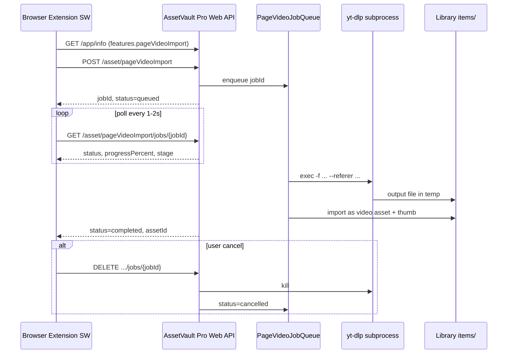

# 作品页视频导入 · Job API 完整规格

> **状态**：待实现（Pro Web API + 扩展 `page-video-import-api.ts`）  
> **读者**：AssetVault Pro 后端/主进程、浏览器扩展、集成脚本作者  
> **关联需求**：[video-import-ytdlp-pro-requirements.md](./video-import-ytdlp-pro-requirements.md)、[video-import-ytdlp-extension-requirements.md](./video-import-ytdlp-extension-requirements.md)  
> **关联实现（规划）**：扩展 `src/shared/page-video-import-api.ts`、`src/background/page-video-import.ts`

---

## 1. 目标与范围

### 1.1 业务目标

| 目标 | 说明 |
|------|------|
| **页面 URL 入库** | 扩展提交作品页链接（YouTube watch、B站 BV、抖音 `/video/` 等），Pro 本机 **yt-dlp** 解析并下载 |
| **异步不阻塞** | HTTP 立即返回 `jobId`；下载在 Pro 后台队列执行 |
| **单条资产** | 每个成功 job 产生 **1 个** `assetId`（视频主文件 + 缩略图） |
| **与直链共存** | 现有 `POST /asset/importFromURL` 对 CDN 直链仍走 HTTP 下载；本 API 专用于作品页 |
| **可取消** | 用户可 `DELETE` job，终止子进程并清理 temp |

### 1.2 非目标（本版不做）

- 扩展内运行 yt-dlp / FFmpeg
- 第三方云端解析 API
- WebSocket 推送（v1 用扩展轮询 `GET .../jobs/{jobId}`）
- 评论/粉丝/playlist 元数据爬取（仅视频文件入库；playlist URL 是否展开由 yt-dlp 行为决定，v1 不保证）
- 在请求体上传浏览器 Cookie 文件（v1 用 `cookiesFromBrowser` 读本机浏览器配置）

### 1.3 职责划分

```text
浏览器扩展                          AssetVault Pro
─────────────────────────────────────────────────────────
作品页 URL 规范化                     —
POST pageVideoImport → jobId          入队、yt-dlp 子进程
GET job 轮询 progress                 下载 → temp → importSingleAsset
DELETE job 取消                       杀进程、删 temp
Toast / 批量失败汇总                  返回 assetId / error.code
```

---

## 2. 为何采用 Job 模型

作品页下载可能耗时 **数分钟**（解析、选轨、合并、大文件写入），若在单次 HTTP 中同步完成，易触发：

1. 扩展 `fetch` 超时  
2. SW 被 MV3 闲置终止  
3. 无法展示进度或取消  

因此 v1 采用 **`POST` 创建 → `GET` 轮询 → 终态**；与 `fullPageSession` 的「长操作」一致，但无需多步 append（单文件输出）。

---

## 3. 总体架构



---

## 4. API 概览

Base：`http://127.0.0.1:41596/api/v1`（JSend、Bearer Token、`LIBRARY_NOT_OPEN` 与 v1 一致）

| 方法 | 路径 | 作用 |
|------|------|------|
| `GET` | `/app/info` | 能力位 `features.pageVideoImport`、`ytdlpVersion` |
| `POST` | `/asset/pageVideoImport` | 创建单条 job |
| `POST` | `/asset/pageVideoImport/batch` | 创建批量 job |
| `GET` | `/asset/pageVideoImport/jobs/{jobId}` | 查询状态与结果 |
| `DELETE` | `/asset/pageVideoImport/jobs/{jobId}` | 取消 job |
| `GET` | `/asset/pageVideoImport/batch/{batchId}` | （可选）批量聚合状态 |
| `POST` | `/system/ytdlp/update` | （可选）更新 yt-dlp 二进制 |

OpenAPI tag 建议：`pageVideoImport`。

**与 `importFromURL` 关系：** 不替代现有端点。Pro 可在 `importFromURL` 内根据 URL 模式 **自动分流** 到本队列（`importMode: auto`），但扩展作品页路径 **应显式** 调用 `pageVideoImport`，避免语义混淆。

---

## 5. 通用约定

### 5.1 JSend 响应

**成功**

```json
{
  "status": "success",
  "data": { }
}
```

**失败**

```json
{
  "status": "error",
  "code": "YTDLP_AUTH_REQUIRED",
  "message": "需要浏览器登录态，请使用 cookiesFromBrowser"
}
```

扩展客户端：当 `status === 'error'` 时抛出 `` `${code}: ${message}` ``（与 `apiRequest` 一致）。

### 5.2 鉴权与前提

- 与现有 v1 相同：`Authorization: Bearer <token>`（若 Pro 配置要求）。  
- 除 `/app/info` 外，所有 `pageVideoImport` 操作要求 **资料库已打开**，否则 `LIBRARY_NOT_OPEN`。

### 5.3 枚举

**`job.status` / 创建时初始状态**

| 值 | 含义 |
|----|------|
| `queued` | 已入队，未开始 |
| `running` | yt-dlp 执行中 |
| `completed` | 已入库，`assetId` 有效 |
| `failed` | 终态失败，`error` 有效 |
| `cancelled` | 用户或系统取消 |

**`job.stage`（`running` 时）**

| 值 | 含义 |
|----|------|
| `queued` | 等待 worker |
| `extracting` | 解析元数据 / 选格式 |
| `downloading` | 传输媒体数据 |
| `postprocessing` | ffmpeg 合并/remux |
| `importing` | 写入资料库、生成缩略图 |
| `done` | 内部收尾（短暂，随后 `completed`） |

### 5.4 `duplicatePolicy`

与现有 URL 导入一致：

| 值 | 行为 |
|----|------|
| `import_copy` | 始终新资产（默认） |
| `use_existing` | 若判定重复则 `skipped: true`，`existingAssetId` 返回 |
| `replace` | （若 Pro 已支持）替换同名资产 |

重复判定建议：同资料库内 `sourceUrl`（作品页 URL）+ 相同主文件哈希，或 Pro 既有 duplicate 规则。

### 5.5 `platform`（提示字段）

扩展传入，用于日志与 UI；**不**作为 Pro 拒绝请求的依据。yt-dlp 以 `url` 为准。

允许值（可扩展）：`youtube` | `bilibili` | `douyin` | `xiaohongshu` | `tiktok` | `twitter` | `instagram` | `facebook` | `vimeo` | `kuaishou` | `kwai` | `xinpianchang` | `generic`

### 5.6 `cookiesFromBrowser`

| 值 | 说明 |
|----|------|
| `edge` | 默认；与 Windows Edge 扩展场景一致 |
| `chrome` | Google Chrome 配置目录 |
| `firefox` | Firefox |
| `none` | 不使用浏览器 Cookie（公开页） |

映射为 yt-dlp `--cookies-from-browser <name>`。失败且 stderr 含 login/cookie 时返回 `YTDLP_AUTH_REQUIRED`。

### 5.7 `format`（yt-dlp `-f`）

| 预设 | 表达式 | 用途 |
|------|--------|------|
| 默认（扩展可不传） | `bv*+ba/b` | 最佳视频+音频，合并 |
| 1080p 上限 | `bv*[height<=1080]+ba/b` | 省空间 |
| 仅音频 | `bestaudio/best` | 音频资产 |
| 最佳单文件 | `b` | 已合并流 |

Pro 设置页可覆盖用户默认；请求体 `format` 优先于全局默认。

### 5.8 `importMode`（仅 `importFromURL` 分流时使用）

| 值 | 行为 |
|----|------|
| `auto` | Pro 判断：直链 → HTTP；作品页 → pageVideoImport 队列 |
| `ytdlp` | 强制走 yt-dlp |
| `direct` | 强制 HTTP 直链（作品页可能失败） |

`pageVideoImport` 端点 **忽略** 本字段（恒为 yt-dlp）。

---

## 6. 接口契约（详细）

### 6.1 `GET /app/info`（扩展字段）

在现有 `data` 上增加（示例）：

```json
{
  "name": "AssetVault Pro",
  "version": "x.y.z",
  "features": {
    "fullPageSession": true,
    "articleBundleSession": false,
    "pageVideoImport": true
  },
  "ytdlp": {
    "version": "2026.05.22",
    "ffmpegPresent": true
  },
  "limits": {
    "pageVideoImport": {
      "maxBatchItems": 50,
      "maxConcurrentJobs": 2,
      "jobTimeoutMs": 3600000,
      "pollIntervalMsRecommended": 1500
    }
  }
}
```

| 字段 | 说明 |
|------|------|
| `features.pageVideoImport` | `false` 时扩展禁用入口 |
| `ytdlp.version` | 当前二进制版本；缺失时为 `null` |
| `limits.pageVideoImport.maxBatchItems` | batch 上限 |
| `limits.pageVideoImport.maxConcurrentJobs` | 全局同时 running 数 |
| `limits.pageVideoImport.jobTimeoutMs` | 单 job 硬超时 |

**能力探测（扩展）：** 优先读 `features.pageVideoImport === true`；若旧 Pro 无 `features`，可 `GET /asset/pageVideoImport/jobs/pvi___capability_probe___` 期望 `JOB_NOT_FOUND`（对齐 fullPageSession 探针模式）。

---

### 6.2 `POST /asset/pageVideoImport`

创建单条导入 job。绑定当前已打开资料库。

**Request**

```json
{
  "url": "https://www.youtube.com/watch?v=dQw4w9WgXcQ",
  "platform": "youtube",
  "targetFolderId": null,
  "duplicatePolicy": "import_copy",
  "format": "bv*+ba/b",
  "cookiesFromBrowser": "edge",
  "sourceMeta": {
    "pageUrl": "https://www.youtube.com/watch?v=dQw4w9WgXcQ",
    "pageTitle": "Example title",
    "submittedBy": "extension",
    "tabId": 42
  },
  "options": {
    "writeSubs": false,
    "subtitleLangs": ["zh-Hans", "en"],
    "noPlaylist": true
  }
}
```

| 字段 | 类型 | 必填 | 说明 |
|------|------|------|------|
| `url` | string | 是 | 作品页 URL，须 `http:` 或 `https:` |
| `platform` | string | 否 | §5.5 |
| `targetFolderId` | string \| null | 否 | 目标文件夹 UUID；`null` 为根 |
| `duplicatePolicy` | string | 否 | 默认 `import_copy` |
| `format` | string | 否 | §5.7；缺省用 Pro 默认 |
| `cookiesFromBrowser` | string | 否 | 默认 `edge` |
| `sourceMeta.pageUrl` | string | 否 | 写入资产 `sourceUrl`；缺省用 `url` |
| `sourceMeta.pageTitle` | string | 否 | 可覆盖显示标题 |
| `sourceMeta.submittedBy` | string | 否 | 审计：`extension` \| `api` \| `playground` |
| `sourceMeta.tabId` | number | 否 | 扩展调试 |
| `options.writeSubs` | boolean | 否 | 默认 `false`；`true` 时 yt-dlp 写外挂字幕到 temp（是否入库 v2） |
| `options.subtitleLangs` | string[] | 否 | 字幕语言过滤 |
| `options.noPlaylist` | boolean | 否 | 默认 `true`：传 playlist URL 时仅下单条或拒绝（Pro 二选一并在文档注明） |

**服务端校验**

1. `url` 解析成功且 host 非空。  
2. 若 `importMode` 分流判定为直链且请求来自错误端点 → 仍允许（本端点仅页面 URL）；若明显为 `.mp4` 直链，可返回 `PAGE_VIDEO_NOT_SUPPORTED` 并提示使用 `importFromURL`。  
3. 活跃 job 数 < 全局上限；否则 `PAGE_VIDEO_QUEUE_FULL`。  
4. `targetFolderId` 存在（若提供）。

**Response `data`**

```json
{
  "jobId": "pvi_8f3c2a1b-4e5d-6f7a-8b9c-0d1e2f3a4b5c",
  "status": "queued",
  "queuePosition": 0,
  "url": "https://www.youtube.com/watch?v=dQw4w9WgXcQ",
  "createdAt": "2026-06-03T12:00:00.000Z",
  "pollAfterMs": 1500
}
```

| 字段 | 说明 |
|------|------|
| `jobId` | 全局唯一，前缀 `pvi_` + UUID |
| `queuePosition` | 前方等待 job 数（含 running 槽位占用策略由 Pro 定义） |
| `pollAfterMs` | 建议扩展下次 GET 间隔 |

**错误码**

| code | HTTP | 场景 |
|------|------|------|
| `LIBRARY_NOT_OPEN` | 409 | 未打开资料库 |
| `INVALID_REQUEST` | 400 | URL 非法、字段类型错误 |
| `PAGE_VIDEO_NOT_SUPPORTED` | 400 | URL 不匹配任何作品页模式且非 yt-dlp 可处理 |
| `PAGE_VIDEO_QUEUE_FULL` | 429 | 队列/并发已满 |
| `YTDLP_NOT_INSTALLED` | 503 | 二进制缺失且自动下载失败 |
| `FOLDER_NOT_FOUND` | 404 | `targetFolderId` 无效 |

---

### 6.3 `POST /asset/pageVideoImport/batch`

一次提交多条作品页 URL，共享队列与默认选项。

**Request**

```json
{
  "items": [
    {
      "url": "https://www.douyin.com/video/7123456789",
      "platform": "douyin",
      "sourceMeta": { "pageTitle": "作品 A" }
    },
    {
      "url": "https://www.douyin.com/video/7987654321",
      "platform": "douyin",
      "sourceMeta": { "pageTitle": "作品 B" }
    }
  ],
  "targetFolderId": null,
  "duplicatePolicy": "import_copy",
  "format": "bv*+ba/b",
  "cookiesFromBrowser": "edge",
  "options": {
    "stopOnError": false
  }
}
```

| 字段 | 类型 | 必填 | 说明 |
|------|------|------|------|
| `items` | array | 是 | 长度 1–`maxBatchItems`（默认 50） |
| `items[].url` | string | 是 | 同单条 |
| `items[].platform` | string | 否 |  per-item 覆盖 |
| `items[].sourceMeta` | object | 否 | per-item 元数据 |
| `options.stopOnError` | boolean | 否 | 默认 `false`：一条失败不影响其余 |

**Response `data`**

```json
{
  "batchId": "pvb_1a2b3c4d-5e6f-7a8b-9c0d-1e2f3a4b5c6d",
  "jobs": [
    {
      "jobId": "pvi_aaa...",
      "url": "https://www.douyin.com/video/7123456789",
      "status": "queued"
    },
    {
      "jobId": "pvi_bbb...",
      "url": "https://www.douyin.com/video/7987654321",
      "status": "queued"
    }
  ],
  "total": 2,
  "createdAt": "2026-06-03T12:00:00.000Z"
}
```

| 字段 | 说明 |
|------|------|
| `batchId` | 前缀 `pvb_` + UUID；可选用于聚合查询 |
| `jobs` | 与 `items` 顺序一致 |

**错误码**

| code | 场景 |
|------|------|
| `BATCH_TOO_LARGE` | `items.length` 超限 |
| `BATCH_EMPTY` | `items` 为空 |
| 其余 | 同单条 |

---

### 6.4 `GET /asset/pageVideoImport/jobs/{jobId}`

查询 job 状态。扩展在 `queued` / `running` 时轮询，终态停止。

**Response `data`（运行中）**

```json
{
  "jobId": "pvi_8f3c2a1b-4e5d-6f7a-8b9c-0d1e2f3a4b5c",
  "batchId": "pvb_1a2b3c4d-...",
  "status": "running",
  "stage": "downloading",
  "progressPercent": 42,
  "url": "https://www.youtube.com/watch?v=dQw4w9WgXcQ",
  "platform": "youtube",
  "assetId": null,
  "skipped": false,
  "existingAssetId": null,
  "error": null,
  "warnings": [],
  "ytDlp": {
    "title": "Example",
    "durationSec": 213,
    "extractor": "youtube"
  },
  "createdAt": "2026-06-03T12:00:00.000Z",
  "startedAt": "2026-06-03T12:00:05.000Z",
  "updatedAt": "2026-06-03T12:01:30.000Z",
  "completedAt": null
}
```

**Response `data`（成功）**

```json
{
  "jobId": "pvi_8f3c2a1b-4e5d-6f7a-8b9c-0d1e2f3a4b5c",
  "status": "completed",
  "stage": "done",
  "progressPercent": 100,
  "assetId": "550e8400-e29b-41d4-a716-446655440000",
  "skipped": false,
  "existingAssetId": null,
  "output": {
    "filename": "Example.mp4",
    "fileBytes": 52428800,
    "durationSec": 213,
    "width": 1920,
    "height": 1080
  },
  "warnings": ["SUBTITLE_NOT_EMBEDDED"],
  "error": null,
  "completedAt": "2026-06-03T12:05:00.000Z"
}
```

**Response `data`（失败）**

```json
{
  "jobId": "pvi_8f3c2a1b-4e5d-6f7a-8b9c-0d1e2f3a4b5c",
  "status": "failed",
  "progressPercent": null,
  "assetId": null,
  "error": {
    "code": "YTDLP_AUTH_REQUIRED",
    "message": "需要登录抖音；请在 Edge 打开并登录后重试",
    "detail": "optional stderr excerpt"
  },
  "completedAt": "2026-06-03T12:02:00.000Z"
}
```

**Response `data`（跳过重复）**

```json
{
  "jobId": "pvi_...",
  "status": "completed",
  "skipped": true,
  "existingAssetId": "uuid-existing",
  "assetId": null
}
```

| 字段 | 说明 |
|------|------|
| `progressPercent` | 0–100；`extracting` 可为 indeterminate（`null`） |
| `warnings` | 非致命；见 §6.8 |
| `ytDlp` | 解析成功后填充；运行早期可为 `null` |

**错误码（HTTP 层）**

| code | 场景 |
|------|------|
| `JOB_NOT_FOUND` | 未知 jobId（含探针 `pvi___capability_probe___`） |

---

### 6.5 `DELETE /asset/pageVideoImport/jobs/{jobId}`

取消 job。

**行为**

1. `queued`：从队列移除，状态 → `cancelled`。  
2. `running`：向 yt-dlp 进程组发终止；删除 `{temp}/{jobId}/`（若存在）。  
3. `completed` / `failed` / `cancelled`：返回 `JOB_ALREADY_TERMINAL`（409）或幂等 `cancelled: true`（实现二选一，**推荐幂等成功**）。

**Response `data`**

```json
{
  "jobId": "pvi_8f3c2a1b-4e5d-6f7a-8b9c-0d1e2f3a4b5c",
  "status": "cancelled",
  "cancelled": true,
  "filesRemoved": true
}
```

**错误码**

| code | 场景 |
|------|------|
| `JOB_NOT_FOUND` | 无效 id |

---

### 6.6 `GET /asset/pageVideoImport/batch/{batchId}`（可选，建议 v1.1）

**Response `data`**

```json
{
  "batchId": "pvb_...",
  "status": "running",
  "total": 10,
  "completed": 3,
  "failed": 1,
  "cancelled": 0,
  "running": 1,
  "queued": 5,
  "jobs": [
    { "jobId": "pvi_...", "status": "completed", "assetId": "..." },
    { "jobId": "pvi_...", "status": "failed", "error": { "code": "YTDLP_DOWNLOAD_FAILED" } }
  ]
}
```

`batch.status`：`queued` | `running` | `completed` | `partial` | `failed` | `cancelled`

扩展 MVP 可仅轮询各 `jobId`，不依赖本端点。

---

### 6.7 `POST /system/ytdlp/update`（可选）

**Request**

```json
{
  "channel": "stable"
}
```

**Response `data`**

```json
{
  "previousVersion": "2026.04.01",
  "currentVersion": "2026.05.22",
  "updated": true
}
```

需 Pro 设置权限或仅本机 loopback；扩展 v1 可不调用。

---

## 7. yt-dlp 执行规范（Pro 实现）

### 7.1 临时目录

```text
{appData}/AssetVault/temp/ytdlp/{jobId}/
  %(title).%(ext)s          # yt-dlp 输出模板（文件名 sanitize）
  *.part                    # 下载中（失败应清理）
```

- `jobId` 与 API 返回一致。  
- 成功后：移动/复制到 `{library}/{assetId}/`，再删 temp。  
- 失败/取消：删整个 `{jobId}` 目录。

### 7.2 命令行（参考）

```bash
yt-dlp \
  --no-playlist \
  --referer "{sourceMeta.pageUrl}" \
  --cookies-from-browser edge \
  -f "bv*+ba/b" \
  --merge-output-format mp4 \
  --paths "{tempDir}" \
  -o "%(title).%(ext)s" \
  "{url}"
```

| 参数 | 来源 |
|------|------|
| `--referer` | `sourceMeta.pageUrl` 或 `url` |
| `-f` | 请求 `format` |
| `--cookies-from-browser` | `cookiesFromBrowser`；`none` 时省略 |
| `--no-playlist` | `options.noPlaylist` 默认 true |

stderr 解析：用于 `stage` 与 `progressPercent`（yt-dlp `[download] xx.x%` 模式）。

### 7.3 超时

| 限制 | 建议值 |
|------|--------|
| 单 job `jobTimeoutMs` | 3_600_000（1h） |
| 无进度心跳 | 若 10min 无 stderr/文件增长 → `failed` `YTDLP_STALLED` |

### 7.4 入库

1. 主文件：扩展名 mp4/mkv/webm 等，`assetType: video`。  
2. 缩略图：yt-dlp `--write-thumbnail` 或 HTTP 拉取 → `_thumb.jpg`。  
3. `sourceUrl` = `sourceMeta.pageUrl` ?? `url`。  
4. `metadata` 建议：

```json
{
  "importPipeline": "pageVideoImport",
  "jobId": "pvi_...",
  "platform": "youtube",
  "ytDlpVersion": "2026.05.22",
  "extractor": "youtube",
  "durationSec": 213,
  "pageTitle": "..."
}
```

---

## 8. URL 分流规则（`importFromURL` 可选）

当 `POST /asset/importFromURL` 带 `importMode: auto` 时，Pro 在服务端判定：

| 模式 | 条件（示例） | 管线 |
|------|----------------|------|
| direct | `.mp4`/`.webm`/`.m3u8`、`googlevideo.com/videoplayback`、`bilivideo.com`、… | 现有 HTTP |
| ytdlp | `youtube.com/watch`、`bilibili.com/video/`、`douyin.com/video/`、… | 创建 `pageVideoImport` job 并 **同步等待** 或返回 `jobId`（**推荐**：返回 `{ jobId, async: true }` 扩展再轮询，避免 importFromURL 阻塞） |

**冻结建议（v1）：** `importFromURL` **不**改为异步；作品页 **仅** 走 `pageVideoImport`。减少契约破坏。

---

## 9. 安全与配额

| 限制 | 建议值 |
|------|--------|
| 全局 `maxConcurrentJobs` | 2 |
| 队列最大排队 | 100 |
| `maxBatchItems` | 50 |
| 单文件输出上限 | 与现有 `importFromURL` 一致（如 300MB） |
| 允许 URL 方案 | 仅 `http`/`https`；禁止 `file:`、`127.0.0.1`（SSRF） |
| 日志 | 记录 jobId、host、platform、耗时；**不**记录 Cookie 内容 |

**过期清理：** 启动时删除 `temp/ytdlp/` 下 orphan 目录；`failed`/`cancelled` job 保留元数据 24h 后淘汰（内存或 sqlite）。

---

## 10. 超时与 HTTP（扩展客户端）

| 操作 | Pro 处理上限 | 扩展 `fetch` timeout |
|------|----------------|----------------------|
| POST create | 5s | 15s |
| POST batch | 10s | 30s |
| GET job | 2s | 10s |
| DELETE cancel | 15s | 20s |
| GET app/info | 2s | 8s |

轮询：`pollAfterMs` 默认 1500；`running` 且 `downloading` 可 1000；终态停止。

---

## 11. 错误码全集

| code | 典型 HTTP | 说明 |
|------|-----------|------|
| `LIBRARY_NOT_OPEN` | 409 | 未打开资料库 |
| `INVALID_REQUEST` | 400 | 参数非法 |
| `FOLDER_NOT_FOUND` | 404 | 文件夹不存在 |
| `PAGE_VIDEO_NOT_SUPPORTED` | 400 | URL 不适合本 API |
| `PAGE_VIDEO_QUEUE_FULL` | 429 | 队列满 |
| `JOB_NOT_FOUND` | 404 | job 不存在 |
| `JOB_ALREADY_TERMINAL` | 409 | 已完成仍取消（若未采用幂等） |
| `BATCH_TOO_LARGE` | 400 | 批量超限 |
| `BATCH_EMPTY` | 400 | items 为空 |
| `YTDLP_NOT_INSTALLED` | 503 | 无二进制 |
| `YTDLP_AUTH_REQUIRED` | 422 | 需登录/Cookie |
| `YTDLP_EXTRACTOR_FAILED` | 422 | 解析失败 |
| `YTDLP_DOWNLOAD_FAILED` | 422 | 下载失败 |
| `YTDLP_POSTPROCESS_FAILED` | 422 | 合并失败 |
| `YTDLP_STALLED` | 422 | 超时无进度 |
| `IMPORT_FAILED` | 500 | 文件已下但入库失败 |
| `DISK_FULL` | 507 | 磁盘不足 |
| `DUPLICATE_SKIPPED` | 200 | 非错误；`skipped: true` |

---

## 12. warnings 枚举

| warning | 含义 |
|---------|------|
| `SUBTITLE_NOT_EMBEDDED` | 请求字幕但未嵌入（v1 可忽略） |
| `THUMBNAIL_FALLBACK` | 缩略图为二次下载 |
| `FORMAT_FALLBACK` | 降级到较低清晰度 |
| `TITLE_SANITIZED` | 标题含非法文件名字符已替换 |
| `PLAYLIST_URL_TRUNCATED` | 传入 playlist 但只处理了首条 |

---

## 13. AssetVault Pro 实现清单

### 13.1 模块划分

| 模块 | 职责 |
|------|------|
| `pageVideoJobStore` | job 状态、batch 聚合 |
| `pageVideoJobQueue` | 并发 worker |
| `ytdlpRunner` | 子进程、进度解析、取消 |
| `ytdlpBinaryManager` | 安装/更新路径 |
| `pageVideoImportHandlers` | HTTP + JSend |
| 复用 `importSingleAsset` / duplicate | 入库 |

### 13.2 路由注册

```text
POST   /api/v1/asset/pageVideoImport
POST   /api/v1/asset/pageVideoImport/batch
GET    /api/v1/asset/pageVideoImport/jobs/:jobId
DELETE /api/v1/asset/pageVideoImport/jobs/:jobId
GET    /api/v1/asset/pageVideoImport/batch/:batchId   # optional
POST   /api/v1/system/ytdlp/update                   # optional
```

### 13.3 文档

- [ ] `doc/web-api-v1-guide.md` § 作品页视频导入  
- [ ] `doc/web-api-v1-openapi.yaml` schemas: `PageVideoJob`, `PageVideoBatch`  
- [ ] Playground 示例 URL  

---

## 14. 浏览器扩展集成方案

### 14.1 类型（`src/shared/page-video-import-types.ts`）

```typescript
export type PageVideoJobStatus =
  | 'queued'
  | 'running'
  | 'completed'
  | 'failed'
  | 'cancelled'

export type PageVideoCreateBody = {
  url: string
  platform?: string
  targetFolderId?: string | null
  duplicatePolicy?: 'import_copy' | 'use_existing' | 'replace'
  format?: string
  cookiesFromBrowser?: 'edge' | 'chrome' | 'firefox' | 'none'
  sourceMeta?: {
    pageUrl?: string
    pageTitle?: string
    submittedBy?: string
    tabId?: number
  }
  options?: {
    writeSubs?: boolean
    subtitleLangs?: string[]
    noPlaylist?: boolean
  }
}

export type PageVideoJob = {
  jobId: string
  batchId?: string | null
  status: PageVideoJobStatus
  stage?: string | null
  progressPercent?: number | null
  url: string
  platform?: string
  assetId?: string | null
  skipped?: boolean
  existingAssetId?: string | null
  error?: { code: string; message: string; detail?: string } | null
  warnings?: string[]
  output?: {
    filename?: string
    fileBytes?: number
    durationSec?: number
    width?: number
    height?: number
  }
  pollAfterMs?: number
  createdAt?: string
  completedAt?: string | null
}
```

### 14.2 API 客户端（`src/shared/page-video-import-api.ts`）

```typescript
export const PAGE_VIDEO_CREATE_TIMEOUT_MS = 15_000
export const PAGE_VIDEO_POLL_TIMEOUT_MS = 10_000
export const PAGE_VIDEO_POLL_INTERVAL_MS = 1_500
export const PAGE_VIDEO_JOB_MAX_POLL_MS = 3_600_000

export async function supportsPageVideoImportApi(): Promise<boolean>
export async function pageVideoImportCreate(body: PageVideoCreateBody): Promise<{ jobId: string; pollAfterMs?: number }>
export async function pageVideoImportBatch(body: { items: PageVideoCreateBody[]; ... }): Promise<{ batchId: string; jobs: { jobId: string }[] }>
export async function pageVideoImportGetJob(jobId: string): Promise<PageVideoJob>
export async function pageVideoImportCancel(jobId: string): Promise<void>
export async function pollPageVideoJobUntilDone(jobId: string, opts?: { onProgress?: (j: PageVideoJob) => void; signal?: AbortSignal }): Promise<PageVideoJob>
```

**能力检测：** 优先 `pingApp()` → `features.pageVideoImport`；否则 GET 探针 jobId `pvi___capability_probe___` → 期望 `JOB_NOT_FOUND`。

### 14.3 SW 编排（`src/background/page-video-import.ts`）

```text
1. IMPORT_PAGE_VIDEO { tabId?, url? }
2. 若无 url：向 tab 取 canonical URL（content PAGE_VIDEO_CONTEXT）
3. supportsPageVideoImportApi() === false → Toast 升级 Pro
4. pageVideoImportCreate({ url, sourceMeta, ...preferences })
5. pollPageVideoJobUntilDone → Toast 成功/失败
6. 可选 assignTags / updateAsset(sourceUrl)
```

**批量：** `IMPORT_PAGE_VIDEO_BATCH` → `pageVideoImportBatch` → 并行轮询（限流 ≤ 4 个 GET）或顺序 poll。

**取消：** `IMPORT_PAGE_VIDEO_ABORT` → `pageVideoImportCancel`。

### 14.4 消息（`src/shared/messages.ts`）

| type | 方向 | payload |
|------|------|---------|
| `IMPORT_PAGE_VIDEO` | UI → SW | `{ url?, tabId?, format? }` |
| `IMPORT_PAGE_VIDEO_BATCH` | UI → SW | `{ items: { url, platform?, pageTitle? }[] }` |
| `IMPORT_PAGE_VIDEO_ABORT` | UI → SW | `{ jobId }` |
| `GET_PAGE_VIDEO_CAPABILITIES` | Popup → SW | — |
| `PAGE_VIDEO_CONTEXT` | SW → CS | — |
| `PAGE_VIDEO_CONTEXT_RESULT` | CS → SW | `{ url, platform, isVideoPage }` |

### 14.5 与现有 API 关系

| API | 用途 |
|-----|------|
| `pageVideoImport` | 作品页（本规格） |
| `importFromURL` | 图片、直链视频、高清图 |
| `importFromURLBatch` | Board Saver 直链批量 |
| `fullPageSession` | 整页截图 |
| `articleBundleSession` | Markdown 资料包 |

---

## 15. 端到端示例（curl）

```bash
# 0. 能力
curl -s http://127.0.0.1:41596/api/v1/app/info -H "Authorization: Bearer TOKEN"

# 1. 创建 job
curl -s -X POST http://127.0.0.1:41596/api/v1/asset/pageVideoImport \
  -H "Authorization: Bearer TOKEN" \
  -H "Content-Type: application/json" \
  -d "{\"url\":\"https://www.youtube.com/watch?v=dQw4w9WgXcQ\",\"platform\":\"youtube\",\"duplicatePolicy\":\"import_copy\",\"cookiesFromBrowser\":\"edge\",\"sourceMeta\":{\"pageUrl\":\"https://www.youtube.com/watch?v=dQw4w9WgXcQ\"}}"

# 2. 轮询
curl -s http://127.0.0.1:41596/api/v1/asset/pageVideoImport/jobs/pvi_8f3c2a1b-4e5d-6f7a-8b9c-0d1e2f3a4b5c \
  -H "Authorization: Bearer TOKEN"

# 3. 取消
curl -s -X DELETE http://127.0.0.1:41596/api/v1/asset/pageVideoImport/jobs/pvi_8f3c2a1b-4e5d-6f7a-8b9c-0d1e2f3a4b5c \
  -H "Authorization: Bearer TOKEN"

# 4. 批量
curl -s -X POST http://127.0.0.1:41596/api/v1/asset/pageVideoImport/batch \
  -H "Authorization: Bearer TOKEN" \
  -H "Content-Type: application/json" \
  -d "{\"items\":[{\"url\":\"https://www.bilibili.com/video/BV1xx411c7mD\"}],\"cookiesFromBrowser\":\"edge\"}"
```

---

## 16. 实施里程碑

| 阶段 | 交付 | 负责 |
|------|------|------|
| **M1** | Pro：create/get/cancel + 队列 + yt-dlp 单条入库 | Pro |
| **M2** | Pro：batch + app/info features + 错误码 | Pro |
| **M3** | 扩展：api client + 单条 Popup/右键 + 轮询 | Extension |
| **M4** | 扩展：Board Saver 批量 + URL 规则 | Extension |
| **M5** | 联调：YT/B站/抖音(登录)；取消；duplicate | 双方 |
| **M6** | OpenAPI + 可选 batch GET + ytdlp update | Pro |

---

## 17. 验收标准

1. 扩展提交 YouTube watch URL，**不传 CDN**，轮询后库内出现可播放视频资产。  
2. B站 BV 页同上。  
3. Edge 已登录抖音时，作品页成功或返回 `YTDLP_AUTH_REQUIRED` 且文案明确。  
4. 下载中 `DELETE` → 无新资产，temp 清理。  
5. `duplicatePolicy: use_existing` 第二次提交 → `skipped: true`。  
6. `features.pageVideoImport: false` 时扩展不调用 create。  
7. 扩展 `pnpm run typecheck` + `pnpm run test`；Pro job 集成测试通过。

---

## 18. 修订记录

| 日期 | 说明 |
|------|------|
| 2026-06-03 | 初版：pageVideoImport Job API 冻结规格 |
